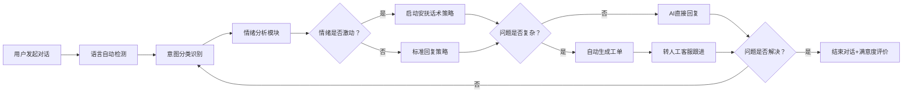

## 1. 产品概述
智能客服系统，通过AI技术自动处理用户咨询、投诉和售后请求，提升客服效率和用户体验。
- 主要目的：实现7x24小时自动化客服接待，减少人工成本，提高响应速度
- 解决问题：传统人工客服响应慢、成本高、多语言支持困难、情绪处理不统一
- 目标用户：电商平台、SaaS服务商、在线教育等需要客服支持的企业
- 市场价值：降低企业客服成本60%以上，提升用户满意度30%，加快问题解决速度5倍

## 2. 核心功能

### 2.1 用户角色
| 角色 | 权限说明 | 核心功能 |
|------|----------|----------|
| 终端用户 | 无需注册即可使用 | 发起对话、切换语言、查看历史记录 |
| 客服管理员 | 需要登录 | 查看工单、分配处理、回复跟进、数据统计 |

### 2.2 功能模块
1. **智能对话页面**：聊天界面、语言切换、情绪状态显示、快捷回复建议
2. **工单管理后台**：工单列表、工单详情、状态流转、优先级排序、搜索筛选
3. **数据分析仪表盘**：对话统计、情绪分布、工单趋势、满意度数据

### 2.3 页面详情
| 页面名称 | 模块名称 | 功能描述 |
|-----------|-------------|---------------------|
| 智能对话页面 | 对话主界面 | 消息气泡、时间戳、发送状态、打字动画、AI回复流式输出 |
| 智能对话页面 | 语言切换器 | 中/英/日三语切换，自动检测输入语言并适配回复语言 |
| 智能对话页面 | 情绪指示器 | 实时显示当前对话情绪状态（正常/关注/激动），配合颜色和图标 |
| 智能对话页面 | 快捷操作区 | 常用问题快捷按钮、上传附件、结束对话、评价服务 |
| 工单管理后台 | 工单列表视图 | 卡片式列表、状态标签、优先级标记、快速筛选 |
| 工单管理后台 | 工单详情面板 | 完整对话记录、问题摘要、处理笔记、状态变更 |
| 工单管理后台 | 工单操作区 | 分配处理人、添加备注、关闭工单、重新打开 |
| 数据分析仪表盘 | 统计概览卡片 | 总对话数、自动解决率、平均响应时间、满意度评分 |
| 数据分析仪表盘 | 趋势图表 | 按日/周/月的对话量趋势、工单量趋势、情绪变化曲线 |

## 3. 核心流程

用户发起对话 → 系统自动识别语言和意图 → 情绪分析模块检测用户情绪 → 根据意图+情绪生成个性化回复 → 如问题复杂自动创建工单 → 持续对话直至问题解决或转人工

客服管理流程：系统自动创建工单 → 管理员查看工单列表 → 进入详情了解问题 → 分配/处理/关闭工单 → 数据同步到统计面板

## 4. 用户界面设计

### 4.1 设计风格
- **主色调**：深海蓝 (#1e3a5f) 作为主色，代表专业与可靠；搭配青色 (#0d9488) 作为AI标识色
- **辅助色**：琥珀色 (#f59e0b) 用于提示关注，红色 (#ef4444) 用于情绪激动警示，绿色 (#10b981) 用于正常状态
- **按钮风格**：圆角12px，带有微妙阴影和悬停上浮动效，主按钮渐变填充
- **字体**：标题使用 "Noto Sans SC" 思源黑体，正文使用系统字体栈，代码和技术术语使用等宽字体
- **布局风格**：聊天界面采用对话式布局，左侧列表右侧详情；工单管理采用卡片式网格布局
- **图标风格**：使用线条风格图标，配合主题色填充，保持简洁现代感

### 4.2 页面设计概述
| 页面名称 | 模块名称 | UI元素 |
|-----------|-------------|-------------|
| 智能对话页面 | 对话主界面 | 渐变背景、玻璃拟态消息气泡、打字指示器动画、情绪状态徽章 |
| 智能对话页面 | 语言切换器 | 胶囊式切换按钮、国旗图标、选中状态高亮动画 |
| 工单管理后台 | 工单列表 | 卡片式布局、状态色条、悬停放大效果、优先级星标 |
| 数据分析仪表盘 | 统计卡片 | 数字滚动动画、趋势箭头、渐变背景、图标装饰 |
| 数据分析仪表盘 | 图表区域 | 平滑折线图、柱状图、饼图、悬停数据提示 |

### 4.3 响应式设计
- **桌面端优先**：设计基准为1440px宽度，双栏布局（对话区+侧边信息）
- **平板适配**：1024px时工单管理变为单列滚动，对话界面全宽显示
- **移动端**：768px以下单栏布局，底部固定输入框，顶部可折叠菜单
- **触摸优化**：所有可点击元素最小44x44px，重要操作增加触觉反馈视觉效果
