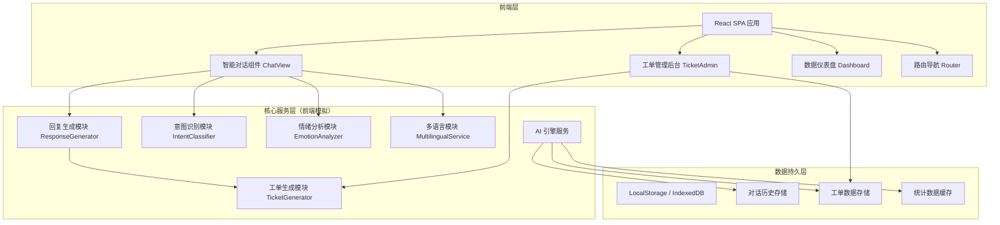

## 1. 架构设计



## 2. 技术说明
- **前端框架**：React@18 + TypeScript + Vite
- **UI 样式**：TailwindCSS@3 + Framer Motion（动画）
- **图表库**：Recharts（数据可视化）
- **图标库**：Lucide React
- **状态管理**：React Context + useReducer
- **数据存储**：LocalStorage（主）+ IndexedDB（对话历史大数据量）
- **初始化工具**：Vite 官方脚手架
- **后端**：无（纯前端实现，AI 引擎使用规则引擎 + 关键词匹配模拟）

## 3. 路由定义
| 路由 | 页面 | 功能说明 |
|-------|---------|-----------|
| `/` | 智能对话页面 | 默认首页，用户与 AI 客服对话主界面 |
| `/admin/tickets` | 工单管理列表 | 管理员查看所有工单、筛选、批量操作 |
| `/admin/tickets/:id` | 工单详情页 | 单个工单完整信息、处理操作、状态变更 |
| `/admin/dashboard` | 数据仪表盘 | 统计数据展示、趋势图表、关键指标 |

## 4. 类型定义
```typescript
// 对话消息
interface Message {
  id: string;
  role: 'user' | 'assistant' | 'system';
  content: string;
  timestamp: number;
  language: 'zh' | 'en' | 'ja';
  emotion?: EmotionState;
  intent?: IntentType;
}

// 情绪状态
type EmotionState = 'calm' | 'concerned' | 'angry';

// 意图分类
type IntentType = 
  | 'consultation'      // 咨询
  | 'complaint'         // 投诉
  | 'after_sales'       // 售后
  | 'refund'            // 退款
  | 'shipping'          // 物流
  | 'product_info'      // 产品信息
  | 'account'           // 账户问题
  | 'greeting'          // 问候
  | 'thanks'            // 感谢
  | 'farewell'          // 道别
  | 'unknown';          // 未知

// 工单
interface Ticket {
  id: string;
  title: string;
  type: IntentType;
  priority: 'low' | 'medium' | 'high' | 'urgent';
  status: 'open' | 'processing' | 'pending' | 'resolved' | 'closed';
  summary: string;
  conversationId: string;
  messages: Message[];
  createdAt: number;
  updatedAt: number;
  assignee?: string;
  notes?: TicketNote[];
  language: 'zh' | 'en' | 'ja';
  emotionLevel: number; // 0-100 负面情绪指数
}

interface TicketNote {
  id: string;
  content: string;
  author: string;
  timestamp: number;
}

// 会话
interface Conversation {
  id: string;
  messages: Message[];
  createdAt: number;
  updatedAt: number;
  currentLanguage: 'zh' | 'en' | 'ja';
  emotionTrend: number[];
  status: 'active' | 'resolved' | 'ticket_created';
  ticketId?: string;
  satisfaction?: number;
}

// 统计数据
interface DashboardStats {
  totalConversations: number;
  autoResolutionRate: number;
  avgResponseTime: number;
  avgSatisfaction: number;
  ticketsCreated: number;
  ticketsResolved: number;
  emotions: { calm: number; concerned: number; angry: number };
  dailyTrend: DailyStat[];
  intentDistribution: Record<IntentType, number>;
}

interface DailyStat {
  date: string;
  conversations: number;
  tickets: number;
  avgSatisfaction: number;
}
```

## 5. 核心模块算法设计

### 5.1 意图识别模块
基于关键词匹配 + 规则引擎的混合分类器：
- 建立多语言关键词词典（中/英/日）
- 计算输入文本与各意图类别的关键词匹配得分
- 使用加权投票机制决定最终意图
- 支持上下文继承（前一轮意图对后一轮有20%权重影响）

### 5.2 情绪分析模块
双重检测机制：
1. **关键词检测**：负面词汇库匹配（如"太差"、"disappointed"、"最悪"等）
2. **语气特征分析**：感叹号数量、大写字母比例、重复字符检测
3. **情绪积分公式**：Score = (负面词数 × 2 + 感叹号数 + 大写比例 × 10) / 文本长度
4. **情绪阈值**：Score < 0.3 → calm；0.3 ≤ Score < 0.7 → concerned；Score ≥ 0.7 → angry

### 5.3 多语言模块
- **语言检测**：Unicode 范围判断（CJK字符→中文/日文，拉丁字符→英文）
- **回复模板系统**：所有回复预置中/英/日三语模板
- **自动切换**：检测到用户输入语言与当前语言不一致时自动切换

### 5.4 工单生成模块
工单创建触发条件（满足任一）：
- 用户连续3轮表达不满（emotionScore ≥ 0.5）
- 连续2轮 AI 回复为 unknown 意图
- 用户明确提及"人工客服"、"转人工"等关键词
- 问题类型为 complaint 且 emotionScore ≥ 0.4

工单优先级判定：
| 条件 | 优先级 |
|------|--------|
| emotionScore ≥ 0.8 或 投诉+退款 | urgent |
| emotionScore ≥ 0.6 或 投诉+物流 | high |
| 一般售后问题 | medium |
| 简单咨询转人工 | low |

工单摘要生成：提取最近5条用户消息中的关键实体（产品名、订单号、金额等）+ 问题类型 + 情绪状态

## 6. 数据模型（LocalStorage Schema）

```typescript
// 存储 Key 定义
enum StorageKeys {
  CONVERSATIONS = 'smartcs_conversations',
  TICKETS = 'smartcs_tickets',
  STATS_CACHE = 'smartcs_stats_cache',
  CURRENT_USER = 'smartcs_current_user',
}

// 索引结构：使用时间戳倒序排列
// conversations: [{id, ...}] → 按 updatedAt DESC
// tickets: [{id, ...}] → 按 createdAt DESC
```

### 6.1 数据初始化种子数据
应用启动时检测无数据则自动注入：
- 10条历史对话（覆盖各意图类型和情绪状态）
- 8条工单记录（不同状态和优先级）
- 近7天的统计趋势数据
